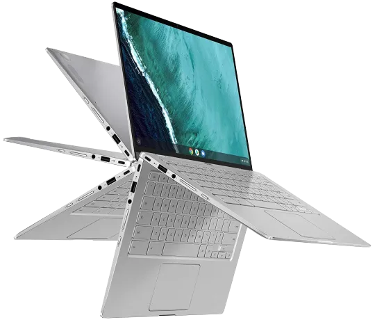

# Chromebook Linux Post-Install — Fedora on Amber Lake Y

<p align="center"></p>

> **TL;DR:** I bought a second-hand ASUS Chromebook Flip C434 for €20, flashed coreboot, and installed Fedora. After following the chrultrabook guide, this script fixes what's left: VAAPI, eMMC tuning, touchpad, screen rotation, tablet mode, zram, journald limits, TRIM. Run `postinstall.sh` after the chrultrabook post-install, then reboot.

## Why This Exists

I bought a second-hand ASUS Chromebook Flip C434 for €20 — originally thinking it had only 4 GB of RAM, but it turned out to be the 8 GB model. The plan was a cheap vacation laptop: if it gets stolen, no big loss. It ended up as my daily web browsing and media client.

After coreboot and Fedora, follow the [chrultrabook post-install guide](https://docs.chrultrabook.com/docs/installing/post-install.html). This script handles the rest: VAAPI decode, eMMC tuning, touchpad, screen rotation, tablet mode, zram, journald limits, TRIM.

**Device guides:**
- [MrChromebox firmware](https://docs.mrchromebox.tech/) — coreboot flash
- [Chrultrabook — Shyvana (C433/C434)](https://docs.chrultrabook.com/docs/devices.html) — device-specific status
- [Chrultrabook — Post Install](https://docs.chrultrabook.com/docs/installing/post-install.html) — audio + keyboard

## Test Hardware

| Component | Spec |
|-----------|------|
| **Model** | ASUS Chromebook Flip C433/C434 (Amber Lake Y) |
| **CPU** | Intel Core m3-8100Y (2C/4T, 1.1 / 3.4 GHz, 5W TDP) |
| **GPU** | Intel UHD Graphics 615 (Gen9.5, GT2, 24 EUs) |
| **RAM** | 8 GB LPDDR3 |
| **Storage** | 58 GB eMMC |
| **Firmware** | coreboot (MrChromebox) |
| **OS** | Fedora 43 XFCE |

## Quick Start

```bash
# 1. Clone and inspect
git clone https://github.com/j3n0v4/chromebook-linux-postinstall.git
cd chromebook-linux-postinstall

# 2. Apply (dry run first)
sudo ./postinstall.sh --dry-run
sudo ./postinstall.sh

# 3. Reboot and verify
sudo reboot
sudo ./verify.sh
```

## What the Script Handles

These issues are resolved by `postinstall.sh` — no manual intervention needed:

- **eMMC tuning** — Auto-detects btrfs vs ext4 and applies correct mount options. Without this, default settings wear out the 58 GB eMMC faster.
- **Zram** — Configures 4 GB zram with lz4 compression, disables swap-on-disk. Without this, swap writes to eMMC, wearing it out.
- **Touchpad** — libinput config for natural scrolling, tap-to-click, palm detection.
- **VAAPI** — Installs `intel-media-driver` for hardware video decode. Without this, video runs on CPU and the fanless 5W chip thermal-throttles.
- **Screen rotation** — Systemd user service that polls the cros-ec-accel display accelerometer. Uses dynamic device discovery because iio device numbers change across reboots. X axis is the primary rotation axis (not Y).
- **Tablet mode** — Udev-triggered script that disables the internal keyboard when the lid is flipped past 360°. Also uses dynamic device discovery.
- **Journald** — Limits log volume to 50M system / 25M runtime. Without this, logs fill the 58 GB eMMC.
- **TRIM** — Enables weekly fstrim. Without this, the eMMC can't reclaim deleted blocks efficiently.

Prerequisites: audio and keyboard need the [chrultrabook post-install guide](https://docs.chrultrabook.com/docs/installing/post-install.html) (audio script + keyd). The postinstall script checks for them but doesn't install them.

## Works Out of the Box

| Component | Notes |
|-----------|-------|
| **WiFi** | Intel Wireless-AC 9560 — works out of the box |
| **Bluetooth** | Intel Bluetooth — works out of the box |
| **Display** | 1920×1080 internal panel — works out of the box |
| **USB-C** | Charging, display output, data — works out of the box |
| **Webcam** | Works out of the box |

## Known Limitations

- **Audio may break after kernel updates** — The chrultrabook audio script uses ALSA UCM configs that can get overwritten. Re-run the setup if speakers go silent after `dnf upgrade`.
- **iio-sensor-proxy can't read cros-ec-accel** — Known Chromebook bug. The rotation script polls the accelerometer directly instead.
- **Auto-rotation** — The systemd user service polls every second. It needs a logged-in X session. Enable with `systemctl --user enable --now xfce-rotate.service` after login.

## Verification

Run `verify.sh` to confirm all postinstall configuration:

```bash
sudo ./verify.sh
```

## License

MIT